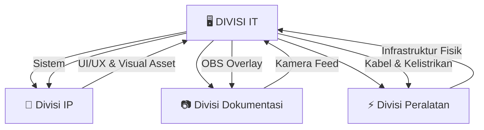

# 🚀 GENOFUNG IT DIVISION

<div align="center">


**Core Engine of Digital Excellence**

[📋 Program Kerja](#-program-kerja) • [🔗 Integrasi](#-integrasi-lintas-divisi) • [📻 Radio Unggulan](#-radio-unggulan) • [👥 Tim](#-tim)

</div>

---

## 🎯 VISI & MISI

> **"Bukan sekadar web unggulan biasa, tapi menjadi Core Engine yang meningkatkan kualitas setiap event lewat digitalisasi dan otomasi."**

| 🎯 Visi | 🛠️ Misi |
|---------|---------|
| Menjadi pusat inovasi digital organisasi | Mengembangkan sistem terintegrasi |
| Meningkatkan kualitas event melalui teknologi | Memastikan akurasi 100% bebas human error |
| Membangun ekosistem digital berkelanjutan | Transfer knowledge kepada anggota |

---

## 💼 PROGRAM KERJA

### 1. 🏆 Sistem Liga Logika MMA
**Web-Hardware Integration System**

```
┌─────────────────────────────────────────────────────────┐
│                    MMA LOGIC LEAGUE                     │
├─────────────────────────────────────────────────────────┤
│  🖥️ Web App  ←→  🔌 Mikrokontroler  ←→  📺 OBS Stream  │
│       ↓              ↓                    ↓             │
│  Live Score     Buzzer Fisik        Visual Overlay      │
│  Leaderboard    (ESP32/Arduino)     Professional        │
└─────────────────────────────────────────────────────────┘
```

**✨ Fitur Utama:**
- 📊 **Live Leaderboard** - Update skor real-time
- 🎯 **Auto-Scoring** - Sistem penilaian otomatis
- ⏱️ **Countdown Timer** - Timer presisi tinggi
- ⚡ **Millisecond Detection** - Pendeteksi penekan tombol tercepat

**💎 Value:** Akurasi 100%, bebas human error, prestisius secara visual

---

### 2. 🎬 VJ & Interactive Live Experience
**Farewell Event Digital Control**

| Fitur | Deskripsi |
|-------|-----------|
| 🎨 **Dynamic Visual** | Kontrol visual dinamis pada smartboard/proyektor |
| 📱 **Live Interaction** | Audiens berinteraksi langsung ke layar utama |
| 🔄 **Real-time Sync** | Sinkronisasi konten secara real-time |

---

### 3. 🌐 Maintenance Website Unggulan
**Digital Asset Optimization**

```bash
✅ Security Optimization
✅ Feature Updates
✅ Performance Enhancement
✅ Bug Fixes & Patches
```

---

## 🔗 INTEGRASI LINTAS DIVISI

<div align="center">



</div>

| Divisi | Kolaborasi | Output |
|--------|------------|--------|
| 🎨 **IP** | UI/UX & Visual Asset | Tampilan aplikasi estetik & profesional |
| 📷 **Dokumentasi** | Kamera Feed | Stream high-level dengan overlay data |
| ⚡ **Peralatan** | Infrastruktur Fisik | Instalasi hardware aman & rapi |

---

## 📻 RADIO UNGGULAN
**Web-Based Broadcasting System**

<div align="center">

| 🎵 **Live Request** | 📡 **Integrated Stream** | 👤 **User Dashboard** |
|---------------------|--------------------------|----------------------|
| Request lagu/salam real-time | Podcast, Musik, Informasi | Login khusus anggota |

</div>

**🎯 Target:** Menjadi media informasi paling interaktif dan modern di lingkungan sekolah

---

## ♻️ KEBERLANGSUNGAN

```
┌────────────────────────────────────────────────────────────┐
│                    SUSTAINABILITY PILLARS                  │
├────────────────────────────────────────────────────────────┤
│                                                            │
│  📚 KNOWLEDGE TRANSFER    →  Skill tidak terpusat 1 orang │
│  📈 INCREMENTAL PROGRESS  →  Cicil kode & riset sebelum H │
│  💡 RESOURCE EFFICIENCY   →  Maksimalkan alat yang ada   │
│                                                            │
└────────────────────────────────────────────────────────────┘
```

---

## 🛠️ TEKNOLOGI STACK

<div align="center">

| Frontend | Backend | Hardware | Cloud |
|----------|---------|----------|-------|
| React/Vue | Node.js | ESP32 | AWS/GCP |
| HTML5/CSS3 | Python | Arduino | Firebase |
| JavaScript | PHP | Sensors | VPS |

</div>

---

## 💰 ESTIMASI KEBUTUHAN

### Hardware
| Item | Quantity | Priority |
|------|----------|----------|
| Mikrokontroler (ESP32/Arduino) | 5-10 | 🔴 High |
| Sensor Tombol (Buzzer) | 10-20 | 🔴 High |
| Kabel Data (Shielded) | 50m | 🟡 Medium |
| Converter Video | 2-3 | 🟡 Medium |

### Software & Cloud
| Service | Purpose | Priority |
|---------|---------|----------|
| Hosting & Domain | Website Unggulan | 🔴 High |
| Cloud Server | Radio Streaming | 🔴 High |
| CDN | Asset Delivery | 🟢 Low |

---

## 📂 STRUKTUR REPOSITORY

```
genofung-it/
├── 📁 mma-league-system/      # Sistem kuis MMA
├── 📁 radio-unggulan/         # Web-based radio
├── 📁 website-maintenance/    # Asset website
├── 📁 hardware-integration/   # Firmware & schematics
├── 📁 docs/                   # Dokumentasi
├── 📁 assets/                 # Visual resources
└── 📄 README.md
```

---

## 👥 TIM IT

<div align="center">

| Role | Responsibilities |
|------|------------------|
| 👨‍💻 **Head of IT** | Strategic planning & coordination |
| 🔧 **Hardware Engineer** | Mikrokontroler & sensor integration |
| 🌐 **Web Developer** | Frontend & backend development |
| 📡 **Stream Operator** | OBS & live broadcasting |
| 🛡️ **Security Specialist** | System security & maintenance |

</div>

---

## 📞 KONTAK & KONTRIBUSI

<div align="center">

[📧 Email](mailto:it@genofung.org) • [💬 Discord](#) • [📱 Instagram](#https://instagram.com/@unggulan.smansasi)

**Bergabung dengan kami!** Kami selalu terbuka untuk kolaborasi dan inovasi baru.

</div>

---

<div align="center">

### ⭐ Made with ❤️ by GENOFUNG IT Division

```
   _____  _____  _____  _____  _____
  / ____||  __ \|  __ \|  __ \|  __ \
 | |  __ | |__) | |__) | |__) | |__) |
 | | |_ ||  ___/|  ___/|  ___/|  _  /
 | |__| || |    | |    | |    | | \ \
  \_____||_|    |_|    |_|    |_|  \_\
  
     DIGITAL EXCELLENCE SINCE 2024
```

**📄 License:** MIT License | **🔒 Security:** Encrypted & Protected

</div>

---

> 💡 *"Technology is best when it brings people together."* — Matt Mullenweg

<div align="center">

[⬆ Back to Top](#-genofung-it-division)

</div>
